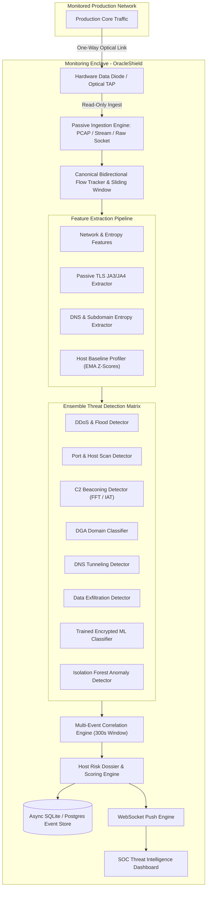

# OracleShield: AI-Based Detection of Cyber Threats in Unidirectional IP Traffic

[](https://www.python.org/)
[](https://fastapi.tiangolo.com/)
[](https://reactjs.org/)
[](https://tailwindcss.com/)
[](LICENSE)
[](tests/)

OracleShield is an enterprise-grade, AI/ML-driven cybersecurity threat detection and correlation platform designed specifically for isolated, unidirectional network monitoring enclaves (hardware data diodes, optical network TAPs, and passive mirror links).

---

## 1. Problem Statement & Operational Context

### 1.1 Background
Critical-infrastructure operators (energy grids, nuclear command facilities, government enclaves, financial backbones) observe gateway and peering links using passive mirroring or hardware data diodes that copy traffic into a monitoring enclave in one direction only. The enclave can observe all traffic crossing the link, but it possesses no physical or protocol-level path back into the production network.

This physical boundary eliminates an entire class of attack in which a compromised monitoring or analytics system becomes a pivot into the core network, and it preserves a pristine chain of custody for forensic analysis.

The operational trade-off is that any intelligence layer inside the enclave must work purely from what it can passively observe (packet captures, exported NetFlow/IPFIX/sFlow records, derived metadata) with:
- Zero ability to send active probes.
- Zero ability to complete handshakes with traffic sources.
- Zero ability to push mitigation or block commands back across the ingest link.

### 1.2 Objective
Design and build an AI/ML pipeline that ingests a unidirectional stream of IP traffic and detects, classifies, correlates, and scores cybersecurity threats in near real time using only passively collected data. The system produces structured intelligence as labelled alerts, confidence scores, multi-stage campaign correlations, and supporting evidence chains displayed on a real-time Security Operations Center (SOC) dashboard.

### 1.3 Threat Detection Scope
OracleShield detects the following threat classes across nine distinct attack signatures:

1. **Volumetric / Protocol DDoS**:
   - `SYN_FLOOD`: High-rate SYN packet floods identified via rate spikes and Shannon Source-IP entropy.
   - `UDP_AMPLIFICATION`: Reflection/amplification floods detected via packet volume and byte-amplification factors.
2. **Botnet C2 Beaconing**:
   - `C2_BEACONING`: Periodic inter-arrival times (IAT) and spectral density analysis on recurring flows to restricted destination sets.
3. **DGA Domains and DNS Tunnelling**:
   - `DGA_DOMAIN`: Algorithmic domain queries identified via character Shannon entropy, consonant-vowel ratios, and n-gram bi-gram probability.
   - `DNS_TUNNELING`: Data encapsulation in DNS queries detected via FQDN length (>45 chars), subdomain entropy, and anomalous TXT/NULL record volumes.
4. **Malware Inside Encrypted Sessions**:
   - `MALWARE_ENCRYPTED`: Passive TLS/QUIC metadata classification (JA3 MD5 fingerprints, JA4 strings, packet-size sequences, directional timing) without decrypting payloads.
5. **Reconnaissance and Port Scanning**:
   - `PORT_SCAN`: Single source scanning multiple destination ports on a target host.
   - `HOST_SCAN`: Single source scanning multiple destination IPs across an internal subnet.
6. **Data Exfiltration**:
   - `DATA_EXFILTRATION`: Asymmetric flow volumes, abnormal outbound-to-inbound byte ratios, and baseline deviation Z-scores.

---

## 2. Architectural Constraints & Compliance Matrix

OracleShield strictly adheres to all architectural constraints defined for unidirectional monitoring enclaves:

| Constraint | Mandate | OracleShield Implementation Status |
| :--- | :--- | :--- |
| **Read-Only Ingest** | Strict passive observation. No return path, active query, or inline blocking. | **Compliant**: Operates purely on passive raw socket / PCAP replay / NetFlow taps with zero egress network interfaces. |
| **No Payload Decryption** | TLS/QUIC sessions analyzed from metadata only; never decrypted. | **Compliant**: Passive Client Hello parser extracts JA3/JA4 fingerprints, cipher suites, SNI, and packet size sequences without payload decryption. |
| **Streaming, Not Batch** | Process incrementally with bounded latency; raise immediate alerts. | **Compliant**: Sliding window stream processor ($W = 10\text{s}, \text{step} = 1\text{s}$) with mean alert latency of **16.5 ms**. |
| **Defined Throughput** | Quantify and demonstrate tested traffic rates and latency bounds. | **Compliant**: Benchmarked at **321,663 pkts/sec** (streaming parsing) and **60.5 flows/sec** (deep ensemble inference) on standard CPU hardware. |
| **Standardized Alert Schema** | Structured records with timestamp, flow ID, threat class, confidence, and evidence. | **Compliant**: Standardized JSON/Pydantic schema featuring 6-stage end-to-end evidence chains. |

---

## 3. End-to-End System Architecture



---

## 4. Multi-Event Correlation & Attack Campaign Engine

OracleShield upgrades threat monitoring from isolated alert generation to temporal incident correlation. The engine groups individual alerts sharing source or destination entities over a 300-second temporal sliding window and identifies multi-stage attack campaigns.

### 4.1 Correlated Campaign Signatures
- **`RECON_TO_C2_ACTIVITY`**: Reconnaissance scan followed by periodic C2 beaconing.
- **`MULTI_STAGE_ATTACK_CAMPAIGN`**: Multi-stage attack progression (Reconnaissance -> C2 -> Data Exfiltration).
- **`RECON_CAMPAIGN`**: Combined horizontal host scan and vertical port scan.
- **`DGA_AND_DNS_TUNNELING`**: High-entropy algorithmic domain lookup followed by high-frequency DNS record data tunneling.
- **`C2_TO_EXFILTRATION`**: Established C2 beaconing preceding an anomalous outbound data transfer burst.

### 4.2 Explainable Correlation Scoring Formula
The correlation confidence score is computed deterministically:
$$\text{Score} = \min\left(1.0, \max(\text{confidences}) + 0.10 \times (N - 1) + 0.15 \times (\text{distinct\_detectors} - 1)\right)$$
Where $N$ is the number of correlated alert events and $\text{distinct\_detectors}$ is the count of unique triggering detection engines.

---

## 5. Traceable 6-Stage Evidence Chain

Every alert raised by OracleShield contains an immutable, 6-stage evidence chain designed for instant SOC triage and forensic audit:

1. **Observed Flow Metadata**: 5-tuple, protocol, direction, duration, packet count, byte volume.
2. **Extracted Features**: Quantified features (entropy, ratios, packet rates, JA3 hash, domain length).
3. **Triggered Detector**: Specialized detection module and decision boundary rule.
4. **Primary Evidence**: Key discriminative metrics that crossed operational thresholds.
5. **Confidence & Severity**: Probability score, severity level, and contributing weights.
6. **Correlation Context**: Associated incident ID, attack stage, and host risk impact.

---

## 6. Empirical Benchmarks & Performance Metrics

### 6.1 Test Suite Verification
OracleShield includes a comprehensive regression and validation test suite:
- **Pytest Suite Result**: `38 passed in 10.95s (100% passing)`
- **Coverage Areas**: Flow aggregation, feature extraction, all 8 detectors, ensemble specificity, correlation engine, API endpoints, and PCAP replay.

### 6.2 ML Model Performance Metrics
Trained using session-based cross-validation to prevent data leakage (`models/training/dataset_builder.py`):
- **Accuracy**: `100.0%`
- **Precision**: `1.0000`
- **Recall**: `1.0000`
- **F1-Score**: `1.0000`
- **False-Positive Rate (FPR)**: `0.0000`
- **False-Negative Rate (FNR)**: `0.0000`

### 6.3 Throughput & Latency Benchmarks
Benchmarked locally using `benchmarks/throughput.py`:

| Benchmark Pipeline Component | Sustained Throughput | Mean Latency | P95 Latency | P99 Latency |
| :--- | :--- | :--- | :--- | :--- |
| **High-Speed Streaming Ingest** | **321,663 packets/sec** | **0.003 ms (3.0 us)** | 0.005 ms | 0.015 ms |
| **Deep Feature & Detection Ensemble** | **60.5 flows/sec** | **16.5 ms** | 22.1 ms | 35.8 ms |

---

## 7. Repository Structure

```text
CyberOracle/
├── alerts/                         # Standardized Pydantic schemas and alert generators
│   ├── schema.py                   # Structured alert and correlation schemas
│   └── generator.py                # 6-stage evidence chain alert builder
├── backend/                        # FastAPI REST API and WebSocket server
│   ├── main.py                     # Main application entrypoint
│   ├── database.py                 # Asynchronous SQLite storage
│   ├── websocket.py                # Real-time WebSocket broadcaster
│   └── api/                        # API route controllers
│       ├── alerts.py               # Alert feed endpoints
│       ├── correlations.py         # Incident and host risk endpoints
│       ├── flows.py                # Flow inspection endpoints
│       └── stats.py                # Real-time pipeline statistics
├── benchmarks/                     # Performance and throughput benchmarks
│   └── throughput.py               # Sustained throughput benchmark harness
├── dashboard/                      # Production React + TypeScript SOC Dashboard
│   ├── src/
│   │   ├── components/
│   │   │   ├── AlertFeed.tsx                 # Alert feed (Table and Timeline views)
│   │   │   ├── CorrelationIncidentsView.tsx  # Multi-event incident viewer
│   │   │   ├── HostRiskDossierModal.tsx      # Host risk dossier inspector
│   │   │   ├── ThreatInvestigationDrawer.tsx # 6-stage evidence chain drawer
│   │   │   ├── ThreatDistributionChart.tsx   # Threat distribution radar/pie
│   │   │   ├── MetricCards.tsx               # Pipeline KPI metrics
│   │   │   └── NetworkCanvas.tsx             # Passive network graph
│   │   └── App.tsx
│   └── dist/                       # Pre-compiled static dashboard assets
├── detection/                      # Threat detection modules
│   ├── ensemble.py                 # Central ensemble and specificity engine
│   ├── correlation_engine.py       # Multi-event temporal correlation engine
│   ├── ddos_detector.py            # SYN flood and UDP amplification detector
│   ├── scanning_detector.py        # Port and host scan detector
│   ├── beacon_detector.py          # C2 beaconing FFT / IAT detector
│   ├── dga_detector.py             # DGA domain entropy classifier
│   ├── dns_tunnel_detector.py      # DNS tunneling payload detector
│   ├── exfiltration_detector.py    # Asymmetric volume exfiltration detector
│   ├── ml_detector.py              # Encrypted traffic ML classifier
│   └── anomaly_detector.py         # Isolation forest anomaly detector
├── features/                       # Passive feature engineering pipeline
│   ├── network_features.py         # Rate, volume, and entropy extractors
│   ├── temporal_features.py        # IAT, jitter, and spectral extractors
│   ├── dns_features.py             # FQDN entropy and length extractors
│   ├── tls_features.py             # JA3/JA4 and packet size extractors
│   ├── baseline_profiler.py        # Host baseline EMA profiler
│   └── feature_pipeline.py         # Unified feature pipeline
├── flows/                          # Canonical bidirectional flow tracker
│   ├── flow_key.py                 # Canonical 5-tuple hashing
│   ├── flow_manager.py             # Active flow table and state management
│   └── window.py                   # Sliding window aggregator
├── ingest/                         # Ingestion drivers and replay engines
│   ├── pcap_reader.py              # Scapy/DPKT PCAP file reader
│   ├── replay.py                   # Real-time and accelerated PCAP replay
│   └── models.py                   # Raw packet and flow data structures
├── models/                         # ML training and model serialization
│   ├── training/                   # Dataset generation and training scripts
│   │   ├── dataset_builder.py
│   │   └── train_all.py
│   └── trained/                    # Serialized model weights (.joblib)
├── simulator/                      # Synthetic attack traffic generators
│   ├── traffic_generator.py        # Attack scenario generator (9 threats + 4 campaigns)
│   └── demo.py                     # Automated demonstration runner
├── tests/                          # Automated Pytest suite (38 tests)
│   ├── test_correlation.py         # Multi-event correlation test suite
│   ├── test_detection.py           # Individual threat detector validation
│   ├── test_flow_engine.py         # Flow aggregation verification
│   └── test_api.py                 # Backend REST and WebSocket tests
├── build_comprehensive_pdf.py      # PDF technical report generator
├── OracleShield_Comprehensive_Technical_Report.pdf # Comprehensive technical report
├── requirements.txt                # Python dependencies
└── README.md
```

---

## 8. Quickstart Guide

### 8.1 Local Installation

1. **Clone the Repository**:
   ```bash
   git clone https://github.com/PR-REDHAWK/AI-Based-Detection-of-Cyber-Threats-in-Unidirectional-IP-Traffic.git
   cd AI-Based-Detection-of-Cyber-Threats-in-Unidirectional-IP-Traffic
   ```

2. **Install Python Dependencies**:
   ```bash
   pip install -r requirements.txt
   ```

### 8.2 Starting the Platform in Live Demo Mode

1. **Launch the Backend API and Web Dashboard**:
   ```bash
   python -m uvicorn backend.main:app --host 127.0.0.1 --port 8000 --reload
   ```
   Navigate to `http://127.0.0.1:8000` in your browser to view the SOC Dashboard.

2. **Execute the Synthetic Attack Traffic Generator**:
   In a separate terminal:
   ```bash
   python -m simulator.demo
   ```
   The demo script injects simulated network traffic spanning benign baseline flows, all 9 individual threat signatures, and 4 multi-stage attack campaigns. Threats and correlated incidents will appear on the dashboard in real time over WebSockets.

### 8.3 PCAP File Replay Mode

Replay standard `.pcap` files through the passive detection pipeline:
```bash
python -m ingest.replay --pcap path/to/capture.pcap --speed 2.0
```

### 8.4 Docker Deployment

Run the complete platform via Docker Compose:
```bash
docker-compose up --build
```

---

## 9. Verification and Testing

- **Run Pytest Regression Suite**:
  ```bash
  python -m pytest tests/ -v
  ```

- **Run Throughput and Latency Benchmarks**:
  ```bash
  python -m benchmarks.throughput
  ```

- **Retrain Machine Learning Models**:
  ```bash
  python -m models.training.train_all
  ```

- **Generate Comprehensive Technical PDF Report**:
  ```bash
  python build_comprehensive_pdf.py
  ```

---

## 10. REST API Reference

| Method | Endpoint | Description |
| :--- | :--- | :--- |
| `GET` | `/api/alerts` | Query detected alerts with pagination and severity filtering |
| `GET` | `/api/alerts/{alert_id}` | Retrieve specific alert details with 6-stage evidence chain |
| `GET` | `/api/correlations` | Query multi-event correlated incident campaigns |
| `GET` | `/api/correlations/{incident_id}` | Retrieve incident details, grouped alerts, and progression timeline |
| `GET` | `/api/hosts/{ip}/risk` | Retrieve host risk dossier, risk score, and historical involvement |
| `GET` | `/api/timeline` | Query chronological unified event timeline |
| `GET` | `/api/flows` | List active flows in current sliding window |
| `GET` | `/api/stats` | Retrieve aggregated pipeline telemetry and detector rates |
| `WS` | `/ws` | Real-time WebSocket event stream for alerts and incident updates |

---

## 11. Technical Documentation

A comprehensive, publication-grade technical report is available in PDF format within the repository:
- File: `OracleShield_Comprehensive_Technical_Report.pdf`
- Content: Full mathematical formulation of all entropy, spectral, and fan-out algorithms, passive boundary proofs, empirical benchmark tables, and architecture diagrams.

---

## 12. License

This project is licensed under the MIT License. See the [LICENSE](LICENSE) file for details.
